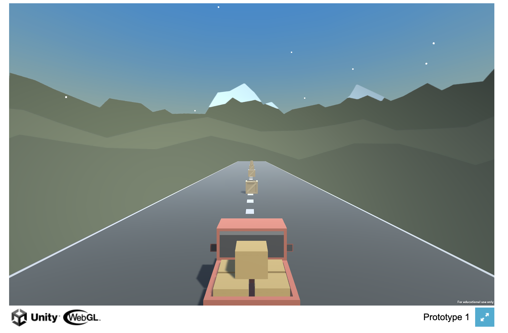

# Racing Game with Obstacle Boxes

Welcome to the Racing Game with Obstacle Boxes! In this simple and exciting game, you'll be in control of a car and your goal is to race through a challenging track filled with obstacle boxes. The objective is to avoid colliding with these boxes and reach the finish line as quickly as possible.

## How to Play

1. **Access the Game**: You can play the game by following this link: [Play Racing Game](https://aagam1090.github.io/CarRacingGame/DevBuild/)

2. **Controls**:
   - Use the **Arrow Keys** (Up, Down, Left, Right) to control the car's movement.
   - Navigate through the track, avoiding collision with the obstacle boxes.

3. **Objective**:
   - Your goal is to complete the race as quickly as possible without hitting any obstacle boxes.

4. **Restart**:
   - If you collide with an obstacle box or want to start over, simply refresh the webpage to restart the game.

## Game Features

- **Simple Gameplay**: This game is designed with simplicity in mind, making it accessible for players of all ages.

- **Challenging Obstacles**: Navigate through a track filled with randomly placed obstacle boxes, adding an element of challenge to the game.

- **Responsive Controls**: The car's controls are responsive and easy to grasp, ensuring an enjoyable gaming experience.

## Feedback

If you have any feedback, suggestions, or encounter any issues while playing the game, please feel free to create an issue on the [GitHub repository](https://github.com/aagam1090/CarRacingGame) or reach out to the developer.

## Credits

This game was developed by [Aagam Shah](https://github.com/aagam1090). Thanks to Aagam for creating this fun game!

## License

This game is open-source and available under the [MIT License](LICENSE.md). Feel free to fork and modify the game according to your preferences.

Enjoy playing the Racing Game with Obstacle Boxes! Good luck, and may your racing skills take you to victory! 🏁🚗💨
